<div align="center">

<picture>
  <source media="(prefers-color-scheme: dark)" srcset="docs/assets/header-en-dark.png">
  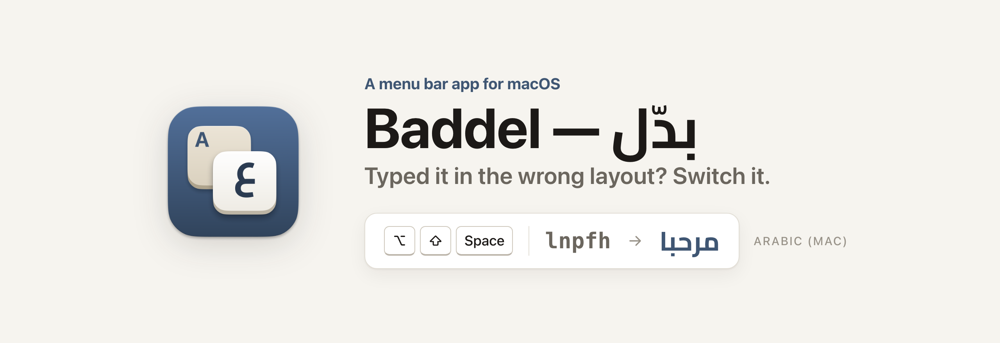
</picture>

[](https://github.com/iSltanX/Baddel/releases/latest)
[](#requirements)
[](#privacy)
[](#features)
[](LICENSE)

### [⬇︎ Download the latest release](https://github.com/iSltanX/Baddel/releases/latest)

<sub>macOS 13 or later · Apple Silicon and Intel · Free and open source</sub>

[The idea](#the-idea) · [How it works](#how-it-works) · [Features](#features) · [Install](#install) · [Usage](#usage) · [Screenshots](#screenshots) · [Technical details](#technical-details) · [العربية](README.md)

</div>

---

## The idea

Anyone who types in two languages knows this moment: you type a full sentence, look up, and find «اثممخ صخقمي» instead of `hello world`, or `sghl ugd;l` instead of «سلام عليكم». The keyboard was set to the other layout.

**Baddel** is a small menu bar tool that fixes this without deleting or retyping anything: one shortcut, and the text is replaced in place with what you meant, in almost any app, and the keyboard switches to the correct language so you can keep typing.

<!-- The demo GIF goes here once recorded: docs/assets/demo.gif -->
<div align="center">
  <br>
  <sub>A small notice confirms what happened, then disappears without taking focus from the app you're typing in.</sub>
</div>

---

## How it works

<picture>
  <source media="(prefers-color-scheme: dark)" srcset="docs/assets/steps-en-dark.png">
  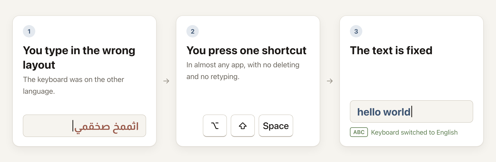
</picture>

| What you have | What happens when you press the shortcut |
| --- | --- |
| **Selected text** | The whole selection is converted in place. |
| **No selection** | The word before the cursor is converted. |
| **A second press within two seconds** | The conversion extends one more word back, so consecutive presses fix a whole sentence. |
| **Undo** | "Undo" in the menu, or a shortcut you assign, restores the original text within 30 seconds. |

The direction is detected automatically: if most of the characters are Arabic, the text is converted to English, and vice versa. Anything already in the other language is left as is.

| You typed | You get |
| --- | --- |
| اثممخ صخقمي | `hello world` |
| `sghl ugd;l` | سلام عليكم (peace be upon you) |
| `;dt hgphg?` | كيف الحال؟ (how are you?) |
| صاغ؟ | `why?` |
| اثممخ صخقمي ok | `hello world ok` |

<details>
<summary><b>Mac and PC layouts, and the "لا" key</b></summary><br>

Baddel builds its map from your own layout, so the result follows it: «مرحبا» is typed `lnpfh` on the **Arabic** (Mac) layout and `lvpfh` on **Arabic‑PC**, and both turn back into «مرحبا».

On **Arabic‑PC**, the <kbd>B</kbd> key types two characters together: «لا». So when Baddel finds «لا» inside a word typed in the wrong layout, it can't tell whether you meant `b` or `gh`. It resolves this with a built-in list of 45,000 English words: «ىهلاف» becomes `night`, not `nibt`. On **Arabic** (Mac), «لا» is typed with two separate keys, so there's no ambiguity: «مهلاف» becomes `light`.
</details>

---

## Features

- **In almost any app.** It reads and replaces text through macOS's Accessibility interface, and when an app doesn't expose its text, it falls back to copy and paste.
- **It knows your layouts.** It doesn't rely on a fixed table — it builds the map from the two layouts active on your Mac, key by key.
- **The clipboard stays as you left it.** It's fully restored after every conversion, whether it held text or an image. Whatever passes through it briefly is tagged with the two [nspasteboard.org](http://nspasteboard.org) markers, so clipboard managers that respect them ignore it — including [Raff](https://github.com/iSltanX/Raff).
- **Fast.** 7–95ms to convert in most of the tested apps: TextEdit, Notes, Safari, Chrome, Brave, Luma, and Claude. Mail and Figma don't expose the field's text, so there it goes through the keyboard and takes 0.3–1.2 seconds.
- **Doesn't monitor what you type.** It doesn't request Input Monitoring, doesn't read anything before you press the shortcut, and doesn't save any text.
- **Lightweight.** About 15MB of memory at idle. The Settings and Welcome windows are created when opened and destroyed when closed.
- **Arabic first.** A right-to-left interface in Cairo and Almarai, with a complete English version, and light and dark modes that follow the system.

---

## Install

1. Download `Baddel_<version>_universal.dmg` from the [releases page](https://github.com/iSltanX/Baddel/releases/latest).
2. Open it and drag **Baddel** into the **Applications** folder.
3. Launch Baddel. The first time, a Gatekeeper warning appears — how to get past it is in the note below.
4. The welcome screen appears: grant **Accessibility** permission in step two, then try the shortcut in step three.

> [!IMPORTANT]
> **Gatekeeper warning:** Baddel is signed with a fixed self-signed certificate, not an Apple Developer ID certificate, and it hasn't gone through Apple Notarization, because this is a personal project. So macOS refuses to open it the first time and says the developer is unidentified.
>
> - **macOS 15 and later:** Try opening it once, then open **System Settings → Privacy & Security**, scroll down to the message about Baddel, and click **Open Anyway**.
> - **macOS 13 and 14:** In Finder, right-click Baddel → **Open** → **Open**.
>
> One time is enough. If it's still blocked, from the terminal:
> ```sh
> xattr -dr com.apple.quarantine /Applications/Baddel.app
> ```

### Requirements

- macOS 13 (Ventura) or later. Tested on **macOS 27**.
- Apple Silicon or Intel (a single Universal package).
- An Arabic layout enabled in **System Settings → Keyboard → Input Sources**. If Baddel can't find an Arabic layout, it falls back to a built-in Arabic (Mac) map, and the Layouts pane will flag it.

### Permission

Just one: **Accessibility**, to read the selected text or the word before the cursor when you press the shortcut, replace it, and send copy/paste keystrokes in apps that don't expose their text. **It does not request** Input Monitoring, Screen Recording, or Full Disk Access: the global shortcut is registered through the system's shortcuts interface.

Every release is signed with the same certificate, and macOS ties the permission to it, so the permission survives updates and isn't requested again.

---

## Usage

| Action | Default |
| --- | --- |
| Convert the selection or last word | <kbd>⌥</kbd><kbd>⇧</kbd><kbd>Space</kbd> |
| Extend the conversion one more word back | The same shortcut again within two seconds |
| Undo the last conversion | No default shortcut: set one from **Settings → Shortcuts**, or use "Undo" in the menu |
| Pause Baddel | No default shortcut, or use the menu |
| Settings | <kbd>⌘</kbd><kbd>,</kbd> from the menu |

- If the shortcut you record is already used by another app, the recorder tells you and keeps your previous shortcut, so you're never left without one.
- Terminals and password managers are excluded by default; add or remove apps from **Settings → Exceptions**.
- Updates are checked automatically once a day, or from the menu → **Check for Updates…**.

---

## Screenshots

<table>
  <tr>
    <td width="50%" align="center" valign="top">
      <picture>
        <source media="(prefers-color-scheme: dark)" srcset="docs/screenshots/onboarding-1-en-dark.png">
        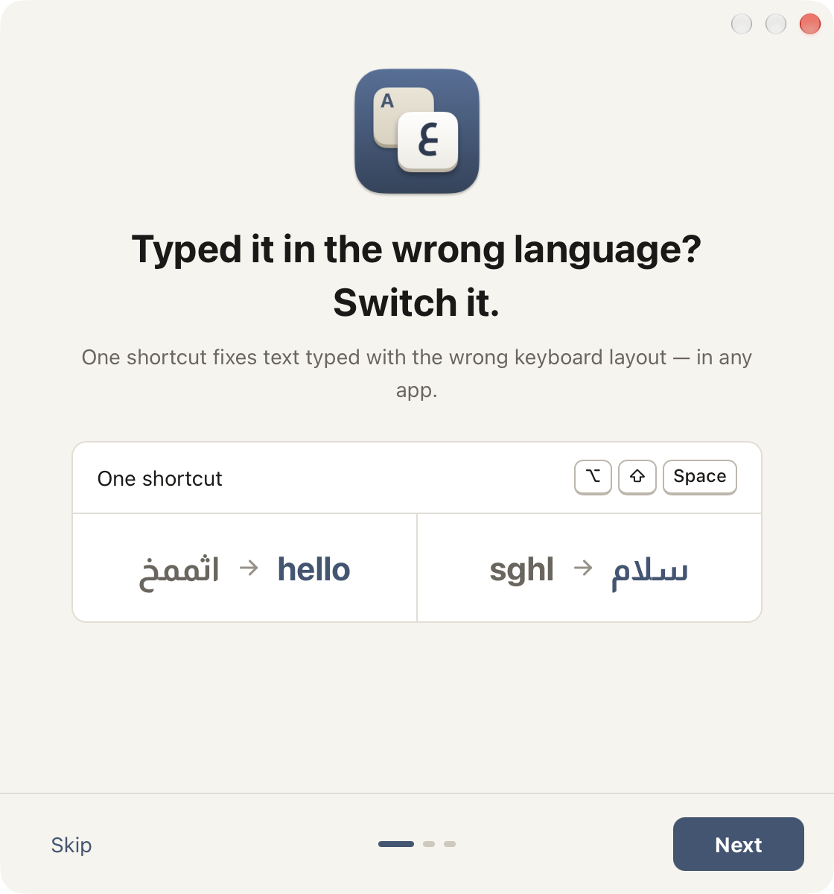
      </picture><br>
      <b>Welcome</b><br>
      Three steps: the idea, then the permission, then a real try with your shortcut.
    </td>
    <td width="50%" align="center" valign="top">
      <picture>
        <source media="(prefers-color-scheme: dark)" srcset="docs/screenshots/settings-general-en-dark.png">
        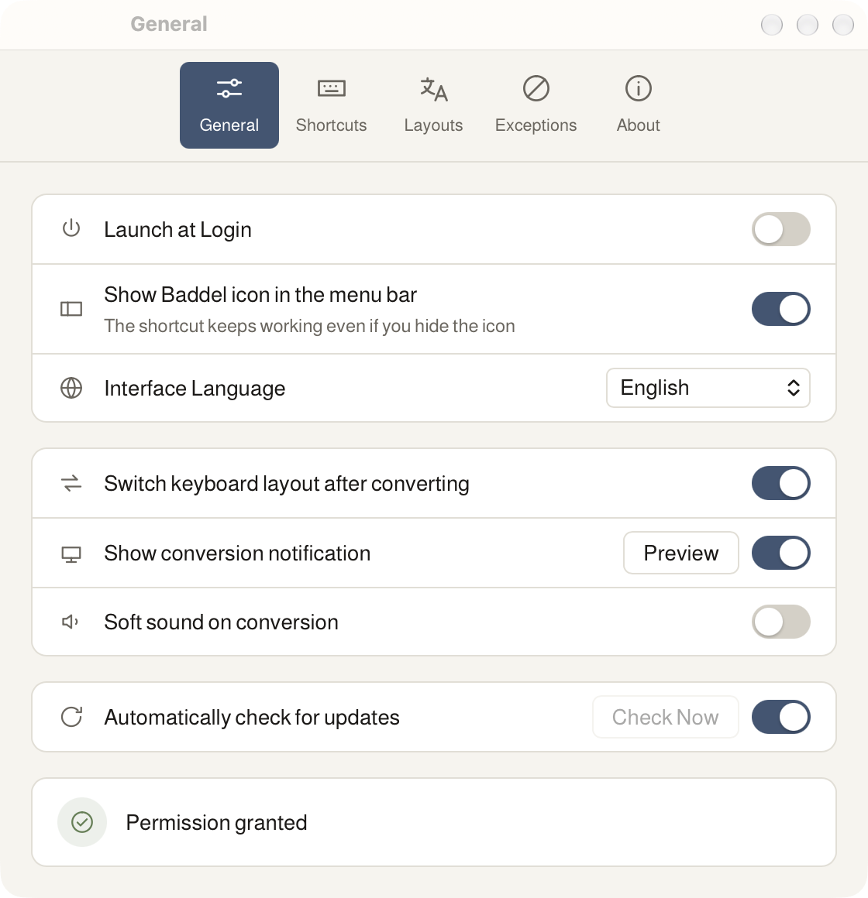
      </picture><br>
      <b>Settings</b><br>
      Launch at Login, switching the keyboard layout after converting, the notification, and updates.
    </td>
  </tr>
  <tr>
    <td width="50%" align="center" valign="top">
      <picture>
        <source media="(prefers-color-scheme: dark)" srcset="docs/screenshots/settings-layouts-en-dark.png">
        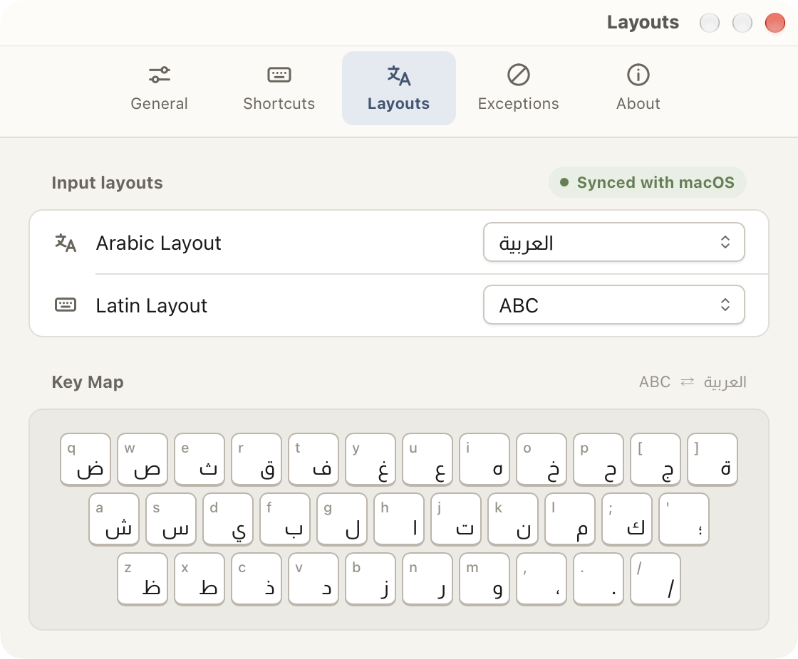
      </picture><br>
      <b>Layouts</b><br>
      The two layouts used for conversion, and the key map as Baddel sees it.
    </td>
    <td width="50%" align="center" valign="top">
      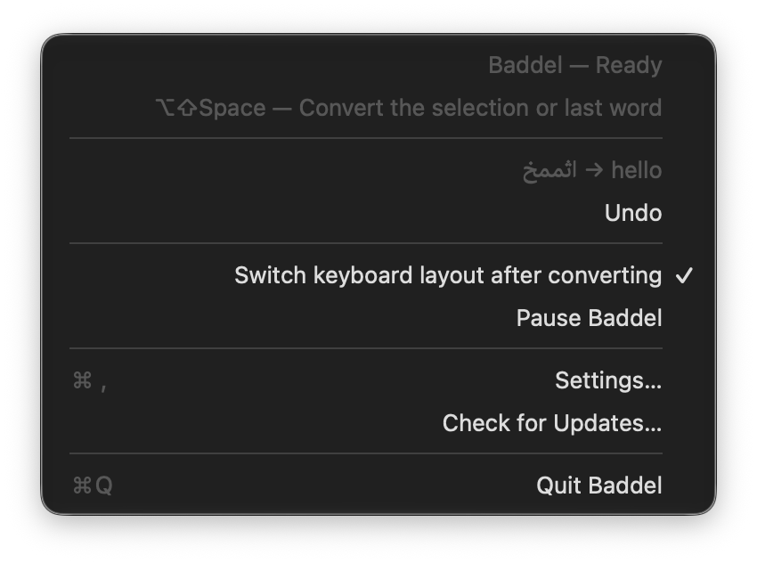<br>
      <b>The menu</b><br>
      The status, the last conversion with Undo for 30 seconds, and Pause.
    </td>
  </tr>
</table>

<div align="center">
  
  
  <br>
  <sub>Notice states: undo, the protected field, and no text.</sub>
</div>

<details>
<summary><b>More screenshots</b></summary>

<table>
  <tr>
    <td width="50%" align="center" valign="top">
      <picture>
        <source media="(prefers-color-scheme: dark)" srcset="docs/screenshots/onboarding-2-en-dark.png">
        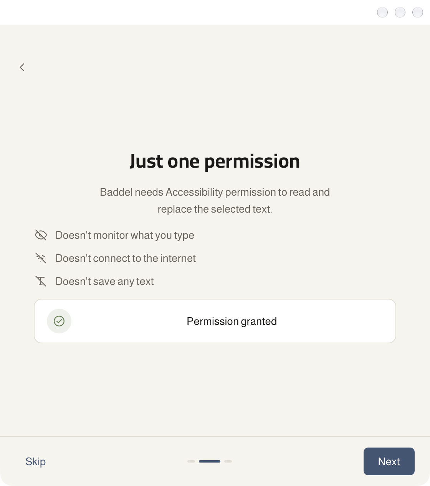
      </picture><br>
      <b>One permission</b><br>
      Accessibility, with the reason written before you grant it. The card checks it live.
    </td>
    <td width="50%" align="center" valign="top">
      <picture>
        <source media="(prefers-color-scheme: dark)" srcset="docs/screenshots/settings-about-en-dark.png">
        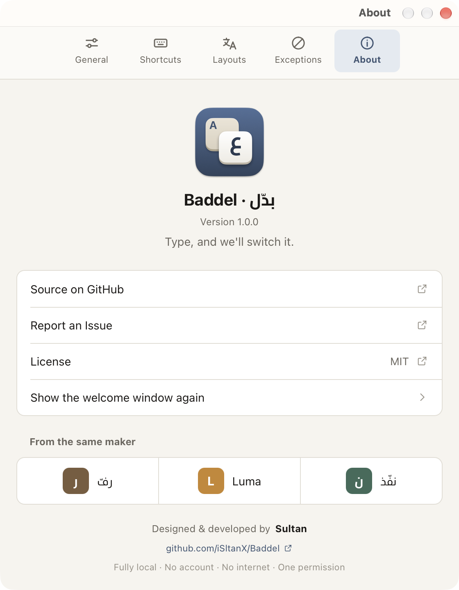
      </picture><br>
      <b>About</b><br>
      The version, the links, and "From the same maker".
    </td>
  </tr>
  <tr>
    <td width="50%" align="center" valign="top">
      <picture>
        <source media="(prefers-color-scheme: dark)" srcset="docs/screenshots/settings-shortcuts-en-dark.png">
        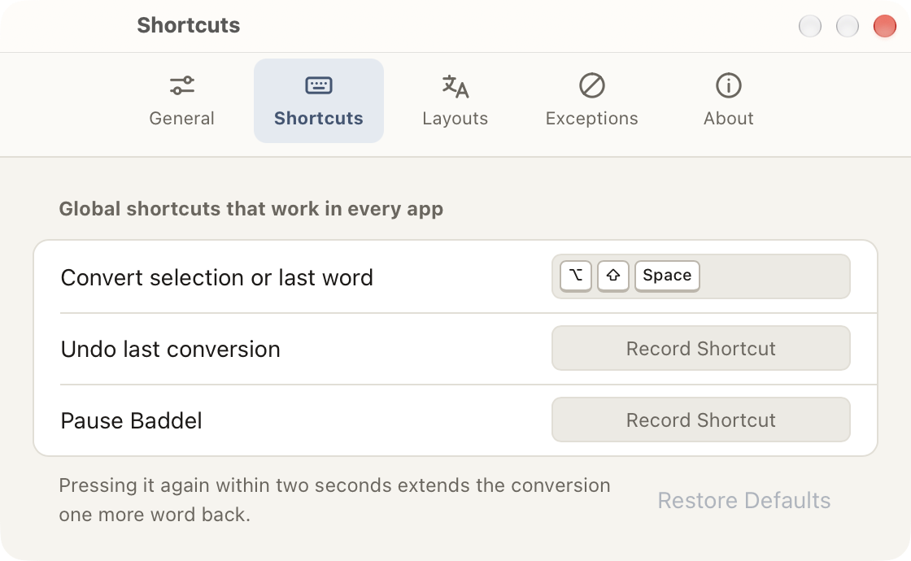
      </picture><br>
      <b>Shortcuts</b><br>
      Three global shortcuts, with a warning for any shortcut already used by another app.
    </td>
    <td width="50%" align="center" valign="top">
      <picture>
        <source media="(prefers-color-scheme: dark)" srcset="docs/screenshots/settings-exceptions-en-dark.png">
        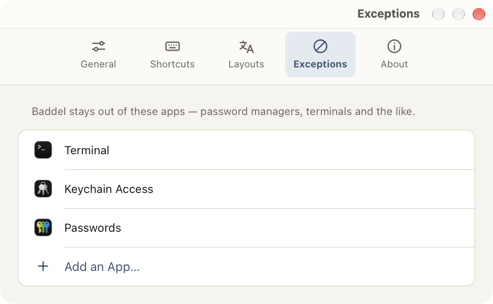
      </picture><br>
      <b>Exceptions</b><br>
      Apps where the shortcut doesn't work. Terminals and password managers are excluded by default.
    </td>
  </tr>
</table>

</details>

<sub>Real screenshots from the built app. All the screenshots, in Arabic and English and both modes, are in [docs/screenshots](docs/screenshots).</sub>

---

## Technical details

A Tauri 2 app: a Rust core holds all the logic and state, and a Svelte 5 UI for Settings and Welcome only displays it. The menu and the notice are native AppKit, so no webview process stays alive at idle. One Universal package, signed, with signed updates.

### Privacy

- **It only reads what it's about to convert,** and only the moment you press the shortcut: the selection, or as much text before the cursor as needed to find the word.
- **It doesn't save any text,** not to disk and not in a log. The last conversion stays in memory for 30 seconds so it can be undone, then it's erased.
- **The clipboard is restored** after every conversion, and whatever passes through it is marked transient and concealed.
- **No network access** except to check for updates: a single request for a `latest.json` file from this repository's releases page, once a day. It carries nothing about you or your text, and you can turn it off from **Settings → General**.
- **No account, no analytics, no tracking.** The interface doesn't request any external resource: fonts are bundled, and the content policy is `default-src 'self'`.
- **Protected fields are never touched:** in a password field, or whenever macOS turns on Secure Input, Baddel reads nothing and writes nothing.

Details in [PRIVACY.md](PRIVACY.md).

### Where it works

| Status | Apps |
| --- | --- |
| **Tested on device** | TextEdit · Notes · Mail (new message) · Safari · Chrome · Brave (in `textarea` and `contenteditable`) · Claude (an Electron app) · Luma (a Tauri app) · Figma (text on the canvas): selection, last word, and extend — and the clipboard is restored every time. Password fields in all three browsers are left alone. |
| **Not tested yet** | Other Electron apps (Slack, VS Code, Discord) · Spotlight. The code path exists for them, but we don't claim what we haven't run. |
| **Deliberately excluded** | Terminals (Terminal, iTerm, Warp, Ghostty, kitty, Alacritty, WezTerm), and password managers (Keychain Access, Passwords, 1Password, Bitwarden, KeePassXC, Enpass). Managed from **Settings → Exceptions**. |

Full results and timings are in [docs/test-matrix.md](docs/test-matrix.md).

<details>
<summary><b>Updates</b></summary><br>

- **Automatically:** the first check happens 20 seconds after launch, then once every 24 hours. No surprise dialog: an "Install Update…" item appears in the menu, and the update status shows in **Settings → General**.
- **Manually:** menu → **Check for Updates…**, or **Settings → General → Check Now**.
- **Signed:** every update package is signed with the project's key, and Baddel rejects any package whose signature doesn't match.
</details>

<details>
<summary><b>Building from source</b></summary><br>

**Requirements:** macOS 13+, Xcode Command Line Tools, Rust (stable), and Node 20+ with npm.

```sh
npm install
./scripts/check.sh              # core tests + clippy + svelte-check + UI build
cargo test -p baddel-core       # core only
npm run dev                     # UI in the browser, with mock stand-ins for Rust commands
./scripts/dev-build.sh          # signed debug bundle in target/debug/bundle/macos/
./scripts/release.sh <version>  # signed Universal release: DMG, update package, and latest.json
```

Accessibility permission is tied to the app's signature, so an unsigned build loses it on every rebuild. `dev-build.sh` signs with the project's identity if one exists, otherwise with the first Apple Development certificate in the keychain. Details in [docs/signing.md](docs/signing.md).

```
crates/baddel-core/   Core: maps, conversion, and لا-key resolution — pure Rust, no Tauri, no macOS
src-tauri/src/
  sys/                All system calls (AX, CGEvent, clipboard, TIS) behind safe interfaces
  controller.rs       Conversion path: guard → selection → extend → last word, and undo
  hud.rs              The notice: a native NSPanel that never takes focus
  tray.rs             The menu and menu bar icon
  updater.rs          The signed updater
  settings.rs         Preferences and their migration
src/                  UI (Svelte 5): Settings and Welcome, display only via invoke
  lib/i18n/           Arabic and English strings
design/               The icon (exported from Figma), and the source of the README images and cover
scripts/              Checks, build, signing, release, and device testing
docs/                 Signing, the test matrix, screenshots, and images
```

Changelog in [CHANGELOG.md](CHANGELOG.md).
</details>

### Frequently asked questions

<details>
<summary><strong>Why does macOS warn me the first time I open it?</strong></summary><br>

Because Baddel is signed with a self-signed certificate, not an Apple Developer ID (a paid annual subscription), so Gatekeeper doesn't recognize its owner. The certificate is fixed across all releases, which is what keeps your permission across updates. How to open it is in [Install](#install).
</details>

<details>
<summary><strong>Does Baddel see what I type?</strong></summary><br>

No. It doesn't monitor the keyboard, and it doesn't request the permission that would allow that (Input Monitoring). It reads nothing except when you press the shortcut, reads only what it's about to convert, and doesn't save it.
</details>

<details>
<summary><strong>What layouts are supported?</strong></summary><br>

Baddel builds the map from the two layouts active on your Mac: it asks macOS for what each key produces, on the plain layer and the <kbd>⇧</kbd> layer. Tested with **Arabic**, **Arabic‑PC**, and **ABC**, and you choose the two layouts from **Settings → Layouts**. It also ships built-in copies of these three as a fallback.
</details>

<details>
<summary><strong>What if the text is mixed?</strong></summary><br>

It converts by majority: if most of the characters are Arabic, the Arabic part is converted to English and the English part is left as is. «اثممخ صخقمي ok» becomes `hello world ok`. Spaces and emoji stay as they are, while digits follow the direction as the keyboard typed them: «فثسف ١٢٣» becomes `test 123`.
</details>

<details>
<summary><strong>Why doesn't it work in the terminal?</strong></summary><br>

Terminals are excluded by default: what you type in them are commands that get executed, and they don't expose an editable text field the way other apps do. You can remove them from **Settings → Exceptions**, but the behavior there is untested.
</details>

<details>
<summary><strong>What about password fields?</strong></summary><br>

It doesn't touch them. In a password field, or whenever Secure Input is on, Baddel stops and shows "Protected field — nothing converted", without reading the text or touching the clipboard. It doesn't rely on Secure Input alone: some browsers (Safari) don't turn it on for password fields. Password managers are also excluded by default.
</details>

<details>
<summary><strong>What are the limits of conversion?</strong></summary><br>

A selection up to 10,000 characters. Without a selection: the word before the cursor, extending one word at a time with each press within two seconds. Undo is available for 30 seconds after conversion.
</details>

<details>
<summary><strong>Why isn't it on the App Store?</strong></summary><br>

App Store apps run inside a sandbox, which blocks controlling other apps' text through Accessibility. Baddel can't work any other way.
</details>

<details>
<summary><strong>Does it work on Intel processors?</strong></summary><br>

Yes. It's a Universal package: a single file that runs natively on both Apple Silicon and Intel.
</details>

<details>
<summary><strong>How do I remove it completely?</strong></summary><br>

1. Turn off **Launch at Login** from **Settings → General** if you enabled it, then **Quit Baddel** from the menu.
2. Delete **Baddel** from the Applications folder.
3. Delete the settings folder: `~/Library/Application Support/com.isltanx.baddel/`
4. Remove "Baddel" from **System Settings → Privacy & Security → Accessibility**.
</details>

---

## Reporting an issue

Open an issue on the [issues page](https://github.com/iSltanX/Baddel/issues), and include: the Baddel version (from **Settings → About**), the macOS version, the app you were typing in, and the two layouts you use.

> Don't paste private text into the issue. Anything you write there becomes public.

## License

The code is licensed under [MIT](LICENSE) — © 2026 Sultan Al-Anzi. The **Cairo** and **Almarai** fonts are licensed under the SIL Open Font License 1.1, and the English word list is from SCOWL. Full texts in [THIRD_PARTY.md](THIRD_PARTY.md).

---

<div align="center">

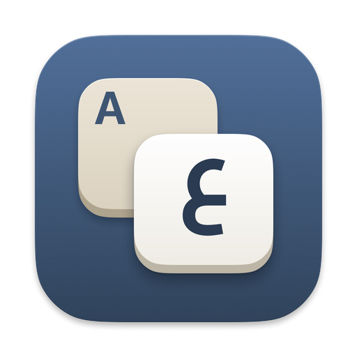

**Designed & developed by Sultan**

From the same maker: [Raff](https://github.com/iSltanX/Raff) · [Luma](https://github.com/iSltanX/Luma) · [Naffith](https://github.com/iSltanX/naffith)

<sub>[Changelog](CHANGELOG.md) · [Privacy](PRIVACY.md) · [العربية](README.md)</sub>

</div>
