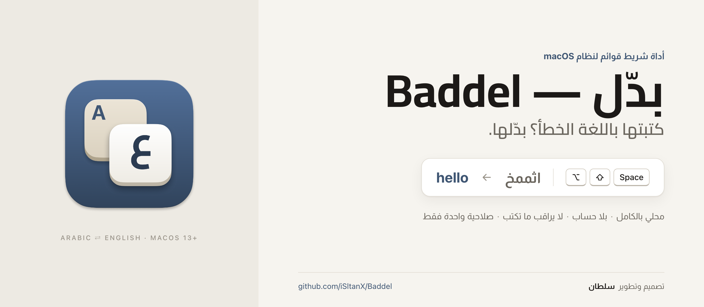
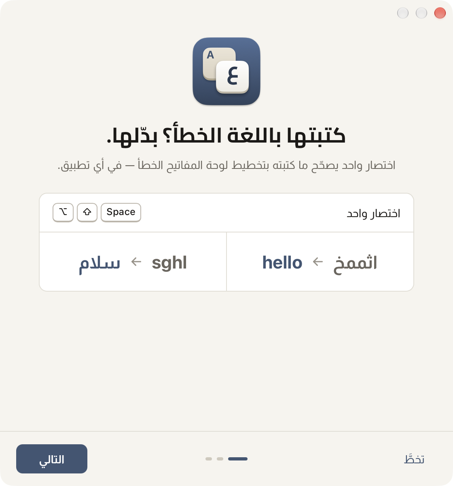
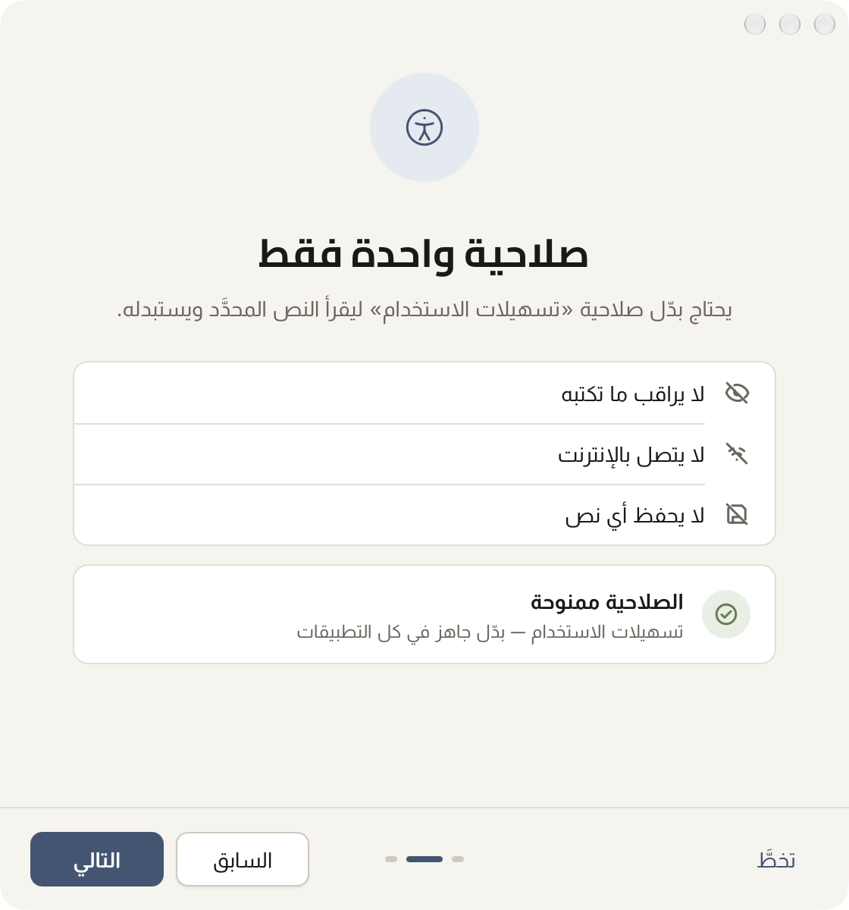
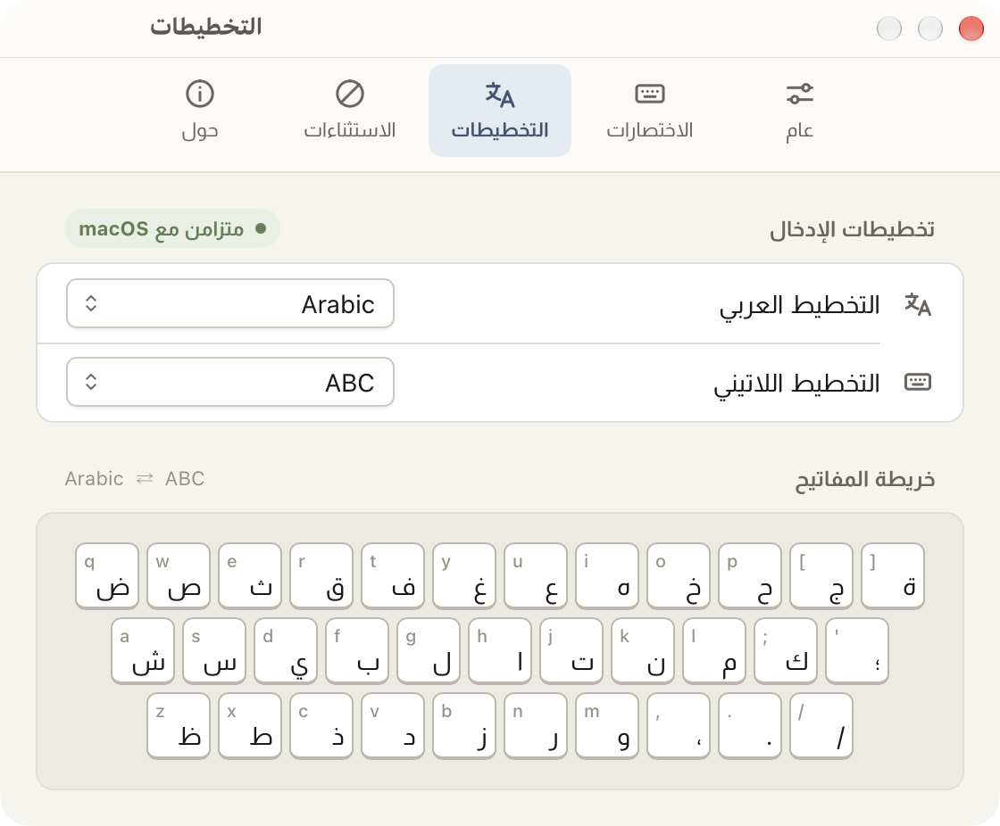
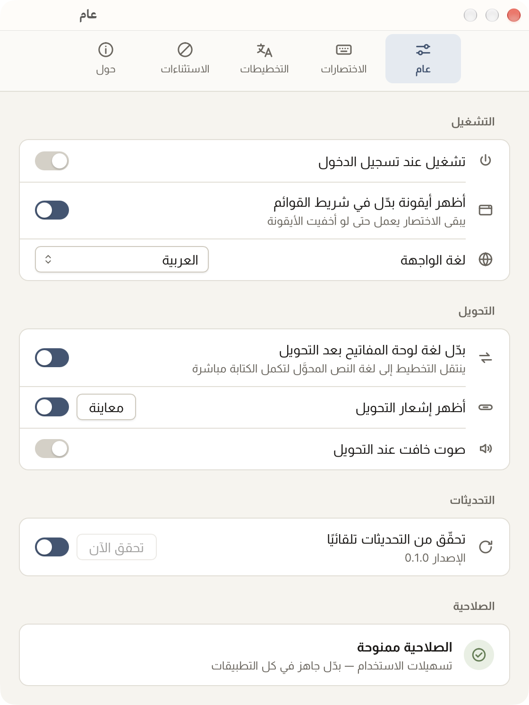
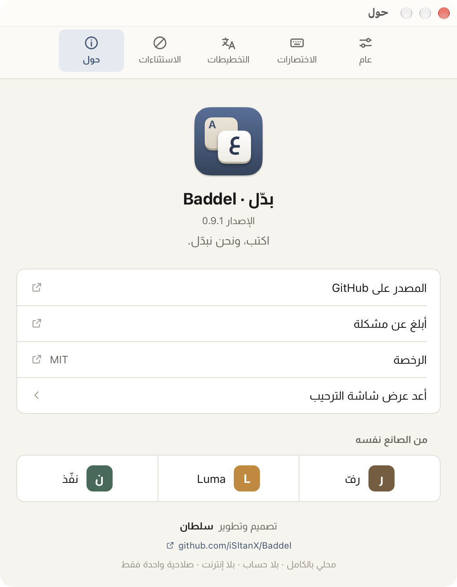
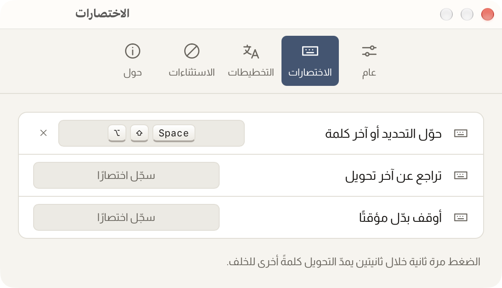
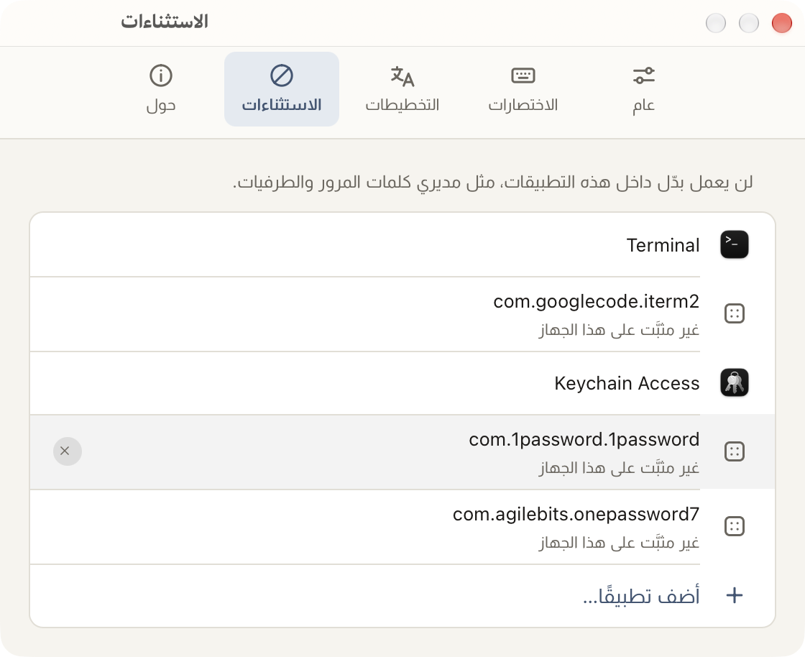

<div dir="rtl">

<div align="center">

<picture>
  <source media="(prefers-color-scheme: dark)" srcset="docs/assets/cover-dark.png">
  
</picture>

**كتبت «اثممخ» وأنت تقصد `hello`؟ اختصار واحد يصحّحها في مكانها، ويبدّل لغة لوحة المفاتيح لتكمل.**

[التثبيت](#التثبيت) · [كيف يعمل](#كيف-يعمل) · [الخصوصية](#الخصوصية) · [الأسئلة](#أسئلة-متكررة) · [English](README.en.md)

[](https://github.com/iSltanX/Baddel/releases/latest)
[](#المتطلبات)
[](#الخصوصية)
[](#لماذا-بدّل)
[](LICENSE)

### [⬇︎ تنزيل أحدث إصدار](https://github.com/iSltanX/Baddel/releases/latest)

<sub>مجاني ومفتوح المصدر · macOS 13 أو أحدث · Apple Silicon وIntel</sub>

</div>

---

## ما هو بدّل؟

كل من يكتب بلغتين يعرف هذه اللحظة: تكتب جملة كاملة، ثم ترفع عينك فتجد «اثممخ صخقمي» بدل `hello world`، أو `sghl ugd;l` بدل «سلام عليكم». لوحة المفاتيح كانت على التخطيط الآخر.

**بدّل** أداة صغيرة في شريط القوائم تصلح هذا دون حذف ولا إعادة كتابة. اضغط <span dir="ltr"><kbd>⌥</kbd><kbd>⇧</kbd><kbd>Space</kbd></span>، فيُستبدل النص بما قصدته في مكانه، في أي تطبيق تقريبًا، وينتقل مصدر الإدخال إلى اللغة الصحيحة لتكمل الكتابة مباشرة.

<!-- GIF العرض يُوضع هنا حين يُسجَّل: docs/assets/demo.gif — السيناريو والمقاسات في docs/launch/demo-gif.md -->
<div align="center">
  <br>
  <sub>إشعار صغير يؤكّد ما حدث، ثم يختفي دون أن يأخذ التركيز من التطبيق الذي تكتب فيه.</sub>
</div>

---

## كيف يعمل

| ما أمامك | ما يحدث حين تضغط الاختصار |
| --- | --- |
| **نص محدَّد** | يُحوَّل التحديد كله في مكانه. |
| **لا تحديد** | تُحوَّل الكلمة التي قبل المؤشر. |
| **ضغطة ثانية خلال ثانيتين** | يمتد التحويل كلمةً أخرى إلى الوراء، فتصحّح جملة كاملة بضغطات متتالية. |
| **تراجع** | «تراجع» في القائمة، أو اختصار تعيّنه أنت، يعيد النص الأصلي خلال 30 ثانية. |

الاتجاه يُكشف وحده: إن كانت أغلب الحروف عربية حُوِّل النص إلى الإنجليزية، وإلا فالعكس. وما كان من اللغة الأخرى يبقى كما هو.

| كتبتَ | يصير |
| --- | --- |
| اثممخ صخقمي | `hello world` |
| `sghl ugd;l` | سلام عليكم |
| <span dir="ltr">`;dt hgphg?`</span> | كيف الحال؟ |
| صاغ؟ | <span dir="ltr">`why?`</span> |
| اثممخ صخقمي ok | `hello world ok` |

### مفتاح «لا»

في تخطيط **Arabic‑PC** يكتب مفتاح <kbd>B</kbd> حرفين معًا: «لا». فإذا وجد بدّل «لا» في كلمة إنجليزية مكتوبة خطأً، لا يعرف أكنت تقصد `b` أم `gh`. يحسم ذلك بقائمة من 45 ألف كلمة إنجليزية مضمَّنة في التطبيق: «ىهلاف» تصير `night`، لا `nibt`.

وفي تخطيط **Arabic** (Mac) تُكتب «لا» بمفتاحين، فلا التباس: «مهلاف» تصير `light`.

---

## لماذا بدّل؟

- **في أي تطبيق تقريبًا.** يقرأ النص ويستبدله عبر واجهة تسهيلات الاستخدام في macOS. وحين لا يكشف التطبيق نصّه، يلجأ إلى النسخ واللصق.
- **يعرف تخطيطاتك.** لا يعتمد على جدول ثابت، بل يبني الخريطة من التخطيطين المفعّلين عندك في macOS، مفتاحًا مفتاحًا.
- **الحافظة كما تركتها.** بعد كل تحويل تعود كاملةً، نصًّا كانت أو صورة. وما يمرّ فيها مؤقتًا يُوسَم بوسمَي [nspasteboard.org](http://nspasteboard.org)، فتتجاهله مديرات الحافظة التي تحترمهما، ومنها [رفّ](https://github.com/iSltanX/Raff).
- **سريع.** يستغرق التحويل من 7 إلى 95 ملّي ثانية في معظم التطبيقات المختبرة: TextEdit وNotes وSafari وChrome وBrave وLuma وClaude. أما Mail وFigma، ولا يكشفان نص الحقل، فيمرّ فيهما عبر لوحة المفاتيح في 0.3 إلى 1.2 ثانية.
- **لا يراقب ما تكتب.** لا يطلب مراقبة الإدخال (Input Monitoring)، ولا يقرأ شيئًا قبل أن تضغط الاختصار، ولا يحفظ أي نص.
- **خفيف.** نحو 15MB من الذاكرة في الخمول. نافذتا الإعدادات والترحيب تُنشآن عند فتحهما وتُهدمان عند الإغلاق.
- **عربي أولًا.** واجهة من اليمين إلى اليسار بخطَّي Cairo وAlmarai، ونسخة إنجليزية كاملة، ووضعان فاتح وداكن يتبعان النظام.

---

## جولة سريعة

<table>
  <tr>
    <td width="50%" align="center" valign="top">
      <picture>
        <source media="(prefers-color-scheme: dark)" srcset="docs/screenshots/onboarding-1-ar-dark.png">
        
      </picture><br>
      <b>الترحيب</b><br>
      ثلاث خطوات: الفكرة، ثم الصلاحية، ثم تجربة حقيقية باختصارك.
    </td>
    <td width="50%" align="center" valign="top">
      <picture>
        <source media="(prefers-color-scheme: dark)" srcset="docs/screenshots/onboarding-2-ar-dark.png">
        
      </picture><br>
      <b>صلاحية واحدة</b><br>
      تسهيلات الاستخدام، وسببها مكتوب قبل أن تمنحها. والبطاقة تتحقق منها حيًّا.
    </td>
  </tr>
</table>

<div align="center">
  <picture>
    <source media="(prefers-color-scheme: dark)" srcset="docs/screenshots/settings-layouts-ar-dark.png">
    
  </picture><br>
  <b>التخطيطات</b><br>
  التخطيطان المستخدمان في التحويل، وخريطة المفاتيح كما يراها بدّل.
</div>

<table>
  <tr>
    <td width="50%" align="center" valign="top">
      <picture>
        <source media="(prefers-color-scheme: dark)" srcset="docs/screenshots/settings-general-ar-dark.png">
        
      </picture><br>
      <b>عام</b><br>
      التشغيل عند الدخول، وتبديل اللغة بعد التحويل، والإشعار، والتحديثات.
    </td>
    <td width="50%" align="center" valign="top">
      <picture>
        <source media="(prefers-color-scheme: dark)" srcset="docs/screenshots/settings-about-ar-dark.png">
        
      </picture><br>
      <b>حول</b><br>
      الإصدار، والروابط، و«من الصانع نفسه».
    </td>
  </tr>
  <tr>
    <td width="50%" align="center" valign="top">
      <picture>
        <source media="(prefers-color-scheme: dark)" srcset="docs/screenshots/settings-shortcuts-ar-dark.png">
        
      </picture><br>
      <b>الاختصارات</b><br>
      ثلاثة اختصارات عامة، ويُنبَّه على أي اختصار يستخدمه تطبيق آخر.
    </td>
    <td width="50%" align="center" valign="top">
      <picture>
        <source media="(prefers-color-scheme: dark)" srcset="docs/screenshots/settings-exceptions-ar-dark.png">
        
      </picture><br>
      <b>الاستثناءات</b><br>
      تطبيقات لا يعمل فيها الاختصار. الطرفيات ومديرو كلمات المرور مستثناة افتراضيًا.
    </td>
  </tr>
</table>
<div align="center">
  
  
  <br>
  <sub>حالات الإشعار: التراجع، والحقل المحمي، ولا نص.</sub>
</div>

<sub>لقطات حقيقية من التطبيق المبني. اللقطات كلها، بالعربية والإنجليزية وبالوضعين، في [docs/screenshots](docs/screenshots).</sub>

---

## الاختصارات

| الإجراء | الافتراضي |
| --- | --- |
| حوّل التحديد أو آخر كلمة | <span dir="ltr"><kbd>⌥</kbd><kbd>⇧</kbd><kbd>Space</kbd></span> |
| مُدّ التحويل كلمةً أخرى إلى الوراء | الاختصار نفسه مرة ثانية خلال ثانيتين |
| تراجع عن آخر تحويل | بلا اختصار افتراضي: عيّنه من **الإعدادات ← الاختصارات**، أو استخدم «تراجع» في القائمة |
| أوقف بدّل مؤقتًا | بلا اختصار افتراضي، أو من القائمة |
| الإعدادات | <span dir="ltr"><kbd>⌘</kbd><kbd>,</kbd></span> من القائمة |

إن كان الاختصار الذي تسجّله مستخدمًا في تطبيق آخر، يخبرك المسجِّل ويُبقي اختصارك السابق، فلا تبقى بلا اختصار.

---

## التثبيت

1. نزّل ملف `Baddel_…_universal.dmg` من [صفحة الإصدارات](https://github.com/iSltanX/Baddel/releases/latest).
2. افتحه واسحب **Baddel** إلى مجلد **التطبيقات**.
3. شغّل بدّل. في المرة الأولى يظهر تحذير Gatekeeper، وطريقة تجاوزه في التنبيه أدناه.
4. تظهر شاشة الترحيب: امنح صلاحية **تسهيلات الاستخدام** في الخطوة الثانية، ثم جرّب الاختصار في الخطوة الثالثة.

</div>

> [!IMPORTANT]
> **تنبيه Gatekeeper:** بدّل موقَّع بشهادة ذاتية ثابتة، لا بشهادة Apple Developer ID، ولم يمرّ بتوثيق Apple (Notarization)، لأنه مشروع شخصي. لذلك يرفض macOS فتحه أول مرة ويقول إن المطوّر غير معروف.
>
> - **في macOS 15 فما بعد:** حاول فتحه مرة، ثم افتح **إعدادات النظام ← الخصوصية والأمن** (Privacy & Security)، وانزل إلى الرسالة عن Baddel، واضغط **افتح على أي حال** (Open Anyway).
> - **في macOS 13 و14:** في Finder انقر على Baddel بالزر الأيمن ← **فتح** ← **فتح**.
>
> تكفي مرة واحدة. وإن استمر المنع، فمن الطرفية:
> ```sh
> xattr -dr com.apple.quarantine /Applications/Baddel.app
> ```

<div dir="rtl">

### المتطلبات

- نظام macOS 13 (Ventura) أو أحدث، ومُختبَر على **macOS 27**.
- معالج Apple Silicon أو Intel، بحزمة Universal واحدة.
- تخطيط عربي مفعّل في **إعدادات النظام ← لوحة المفاتيح ← مصادر الإدخال**. إن لم يجد بدّل تخطيطًا عربيًا، يعمل بخريطة Arabic (Mac) مضمَّنة، وتنبّهك لوحة التخطيطات.

---

## الصلاحية

| الصلاحية | لماذا |
| --- | --- |
| **تسهيلات الاستخدام** (Accessibility) | لقراءة النص المحدَّد أو الكلمة قبل المؤشر حين تضغط الاختصار، واستبداله، وإرسال ضغطات النسخ واللصق في التطبيقات التي لا تكشف نصّها. |

هذه الصلاحية الوحيدة. **ولا يطلب** مراقبة الإدخال (Input Monitoring)، ولا تسجيل الشاشة، ولا الوصول الكامل إلى القرص. الاختصار العام يُسجَّل عبر واجهة الاختصارات في النظام، فلا يحتاج بدّل إلى مراقبة لوحة المفاتيح.

كل إصدار يُوقَّع بالشهادة نفسها، وmacOS يربط الصلاحية بها، فتبقى الصلاحية عبر التحديثات ولا تُطلب من جديد.

---

## الخصوصية

بدّل لا يملك سببًا ليعرف ما تكتب، ولا طريقًا ليرسله إلى أي مكان:

- **لا يقرأ إلا ما سيحوّله،** وفي لحظة ضغطك الاختصار فقط: التحديد، أو ما قبل المؤشر بقدر ما يلزم لإيجاد الكلمة.
- **لا يحفظ أي نص،** لا على القرص ولا في سجل. آخر تحويل يبقى في الذاكرة 30 ثانية ليمكن التراجع عنه، ثم يُمحى.
- **الحافظة تعود كما كانت** بعد كل تحويل، وما يمرّ فيها موسوم بأنه مؤقت وسرّي.
- **لا شبكة** إلا للتحقق من التحديثات: طلب واحد لملف `latest.json` من صفحة إصدارات هذا المستودع، مرة في اليوم. لا يحمل شيئًا عنك ولا عن نصّك، ويصل GitHub منه ما يصله من أي تنزيل عادي. ويمكن إيقافه من **الإعدادات ← عام**.
- **لا حساب، ولا تحليلات، ولا تتبّع.** والواجهة لا تطلب أي مورد خارجي: الخطوط مضمَّنة، وسياسة المحتوى <span dir="ltr">`default-src 'self'`</span>.
- **الحقول المحمية لا تُمسّ:** في حقل كلمة مرور، أو حين يفعّل macOS الإدخال الآمن (Secure Input)، لا يقرأ بدّل شيئًا ولا يكتب شيئًا.

التفاصيل في [PRIVACY.md](PRIVACY.md).

---

## التحديث

- **تلقائيًا:** أول تحقق بعد 20 ثانية من التشغيل، ثم مرة كل 24 ساعة. لا حوار مفاجئ: يظهر عنصر «ثبّت التحديث…» في القائمة، وحالة التحديث في **الإعدادات ← عام**.
- **يدويًا:** القائمة ← **تحقّق من التحديثات…**، أو **الإعدادات ← عام ← تحقق الآن**.
- **موقَّع:** كل حزمة تحديث موقَّعة بمفتاح المشروع، ويرفض بدّل أي حزمة لا يطابق توقيعها.

---

## أين يعمل

| الحالة | التطبيقات |
| --- | --- |
| **مُختبَر على الجهاز** | TextEdit · Notes · Mail (نافذة رسالة جديدة) · Safari · Chrome · Brave (في `textarea` و`contenteditable`) · Claude (تطبيق Electron) · Luma (تطبيق Tauri) · Figma (نص على اللوحة): التحديد وآخر كلمة والمدّ، والحافظة تعود كما كانت في كل مرة. وحقول كلمات المرور في المتصفحات الثلاثة لا تُمسّ. |
| **لم يُختبر بعد** | تطبيقات Electron الأخرى (Slack وVS Code وDiscord) · Spotlight. المسار موجود لها، لكننا لا ندّعي ما لم نشغّله. |
| **مستثنى عمدًا** | الطرفيات (Terminal وiTerm وWarp وGhostty وkitty وAlacritty وWezTerm)، ومديرو كلمات المرور (Keychain Access وPasswords و1Password وBitwarden وKeePassXC وEnpass). تُدار من **الإعدادات ← الاستثناءات**. |

النتائج والأزمنة بالتفصيل في [docs/test-matrix.md](docs/test-matrix.md).

---

## أسئلة متكررة

<details>
<summary><strong>لماذا يحذّرني macOS حين أفتحه أول مرة؟</strong></summary><br>

لأن بدّل موقَّع بشهادة ذاتية لا بشهادة Apple Developer ID (اشتراك سنوي مدفوع)، فلا يعرف Gatekeeper صاحبها. الشهادة ثابتة لكل الإصدارات، وهذا ما يحفظ صلاحيتك عبر التحديثات. طريقة الفتح في [التثبيت](#التثبيت).
</details>

<details>
<summary><strong>هل يرى بدّل ما أكتبه؟</strong></summary><br>

لا. لا يراقب لوحة المفاتيح، ولا يطلب الصلاحية التي تتيح ذلك (Input Monitoring). لا يقرأ شيئًا إلا حين تضغط الاختصار، ولا يقرأ إلا ما سيحوّله، ولا يحفظه.
</details>

<details>
<summary><strong>ما التخطيطات المدعومة؟</strong></summary><br>

يبني بدّل الخريطة من التخطيطين المفعّلين عندك: يسأل macOS عن مخرجات كل مفتاح فيهما، بالطبقة العادية وطبقة <kbd>⇧</kbd>. اختُبر مع **Arabic** و**Arabic‑PC** و**ABC**، وتختار التخطيطين من **الإعدادات ← التخطيطات**. وفيه نسخ مضمَّنة من هذه الثلاثة احتياطًا.
</details>

<details>
<summary><strong>ماذا لو كان النص مختلطًا؟</strong></summary><br>

يُحوَّل حسب الأغلبية: إن كانت أغلب الحروف عربية حُوِّل العربي إلى إنجليزي، وبقي الإنجليزي كما هو. «اثممخ صخقمي ok» تصير `hello world ok`. والمسافات والرموز التعبيرية تبقى كما هي، أما الأرقام فتتبع الاتجاه كما تكتبها لوحة المفاتيح: «فثسف ١٢٣» تصير `test 123`.
</details>

<details>
<summary><strong>لماذا لا يعمل في الطرفية؟</strong></summary><br>

الطرفيات مستثناة افتراضيًا: ما تكتبه فيها أوامر تُنفَّذ، وهي لا تكشف حقل نص قابلًا للتحرير كبقية التطبيقات. يمكنك إزالتها من **الإعدادات ← الاستثناءات**، لكن السلوك فيها غير مختبَر.
</details>

<details>
<summary><strong>وحقول كلمات المرور؟</strong></summary><br>

لا يلمسها. في حقل كلمة مرور، أو حين يكون الإدخال الآمن (Secure Input) مفعّلًا، يتوقف بدّل ويعرض «حقل محمي — لم يُحوَّل شيء»، دون أن يقرأ النص أو يمسّ الحافظة. ولا يعتمد على الإدخال الآمن وحده، فبعض المتصفحات (Safari) لا تفعّله في حقول كلمات المرور. ومديرو كلمات المرور مستثناة افتراضيًا أيضًا.
</details>

<details>
<summary><strong>ما حدود التحويل؟</strong></summary><br>

التحديد حتى 10 آلاف حرف. وبلا تحديد: الكلمة قبل المؤشر، وتمتد كلمةً كلمة مع كل ضغطة خلال ثانيتين. والتراجع متاح 30 ثانية بعد التحويل.
</details>

<details>
<summary><strong>لماذا ليس في App Store؟</strong></summary><br>

تطبيقات App Store تعمل داخل Sandbox، وهو يمنع التحكم في نصوص التطبيقات الأخرى عبر تسهيلات الاستخدام. وبدّل لا يعمل بغير ذلك.
</details>

<details>
<summary><strong>هل يعمل على معالجات Intel؟</strong></summary><br>

نعم. الحزمة Universal: ملف واحد يعمل أصيلًا على Apple Silicon وIntel.
</details>

<details>
<summary><strong>كيف أزيله تمامًا؟</strong></summary><br>

1. أطفئ **تشغيل عند تسجيل الدخول** من **الإعدادات ← عام** إن كنت فعّلته، ثم **إنهاء بدّل** من القائمة.
2. احذف **Baddel** من مجلد التطبيقات.
3. احذف مجلد الإعدادات: <span dir="ltr">`~/Library/Application Support/com.isltanx.baddel/`</span>
4. أزل «بدّل» من **إعدادات النظام ← الخصوصية والأمن ← تسهيلات الاستخدام**.
</details>

---

## للمطوّرين

**المتطلبات:** macOS 13 أو أحدث، وأدوات سطر أوامر Xcode، وRust (stable)، وNode 20 أو أحدث مع npm.

| الأمر | ما يفعله |
| --- | --- |
| <span dir="ltr">`npm install`</span> | يثبّت اعتماديات الواجهة |
| <span dir="ltr">`./scripts/check.sh`</span> | اختبارات النواة، وclippy، وsvelte-check، وبناء الواجهة |
| <span dir="ltr">`cargo test -p baddel-core`</span> | اختبارات النواة وحدها |
| <span dir="ltr">`npm run dev`</span> | الواجهة في المتصفح، مع بدائل وهمية لأوامر Rust |
| <span dir="ltr">`./scripts/dev-build.sh`</span> | حزمة debug موقَّعة في <span dir="ltr">`target/debug/bundle/macos/`</span> |
| <span dir="ltr">`./scripts/release.sh <version>`</span> | إصدار Universal موقَّع: DMG وحزمة التحديث و<span dir="ltr">`latest.json`</span> |

صلاحية تسهيلات الاستخدام مربوطة بتوقيع التطبيق، فحزمة غير موقَّعة تفقدها مع كل بناء. يوقّع `dev-build.sh` بهوية المشروع إن وُجدت، وإلا بأول شهادة Apple Development في سلسلة المفاتيح. التفاصيل في [docs/signing.md](docs/signing.md).

<details>
<summary><b>بنية المشروع</b></summary>

| المسار | ما فيه |
| --- | --- |
| <span dir="ltr">`crates/baddel-core/`</span> | النواة: الخرائط والتحويل وحسم «لا». Rust صِرف، بلا Tauri ولا macOS |
| <span dir="ltr">`src-tauri/src/sys/`</span> | كل استدعاءات النظام (AX وCGEvent والحافظة وTIS) خلف واجهات آمنة |
| <span dir="ltr">`src-tauri/src/controller.rs`</span> | مسار التحويل: الحراسة، ثم التحديد، ثم المدّ، ثم آخر كلمة، والتراجع |
| <span dir="ltr">`src-tauri/src/hud.rs`</span> | الإشعار: NSPanel أصيل لا يأخذ التركيز |
| <span dir="ltr">`src-tauri/src/tray.rs`</span> | القائمة وأيقونة شريط القوائم |
| <span dir="ltr">`src-tauri/src/updater.rs`</span> | التحديث الموقَّع |
| <span dir="ltr">`src-tauri/src/settings.rs`</span> | التفضيلات وترحيلها |
| <span dir="ltr">`src/`</span> | الواجهة (Svelte 5): الإعدادات والترحيب، عرضٌ فقط عبر <span dir="ltr">`invoke`</span> |
| <span dir="ltr">`src/lib/i18n/`</span> | النصوص العربية والإنجليزية |
| <span dir="ltr">`design/`</span> | الأيقونة (مُصدَّرة من Figma) والغلاف |
| <span dir="ltr">`scripts/`</span> | الفحص والبناء والتوقيع والإصدار واختبار الجهاز |
| <span dir="ltr">`docs/`</span> | الخطة والتوقيع ومصفوفة الاختبار واللقطات |

</details>

كل منطق التطبيق وحالته في Rust، والواجهة تعرض فقط. والقائمة والإشعار أصيلان لا webview، فلا تبقى عملية webview حيّة في الخمول. سجل التغييرات في [CHANGELOG.md](CHANGELOG.md).

---

## الإبلاغ عن مشكلة

افتح مسألة في [صفحة المسائل](https://github.com/iSltanX/Baddel/issues)، واذكر: إصدار بدّل (من **الإعدادات ← حول**)، وإصدار macOS، والتطبيق الذي كنت تكتب فيه، والتخطيطين المستخدمين.

> لا تنسخ نصًّا خاصًّا في المسألة. ما تكتبه هناك يصير علنيًّا.

---

## الرخصة

الشيفرة مرخَّصة بـ[MIT](LICENSE).

الخطّان **Cairo** و**Almarai** برخصة SIL Open Font License 1.1، وقائمة الكلمات الإنجليزية من SCOWL. النصوص الكاملة في [THIRD_PARTY.md](THIRD_PARTY.md).

---

<div align="center">


**تصميم وتطوير: سلطان** · Designed & developed by Sultan

من الصانع نفسه: [رفّ](https://github.com/iSltanX/Raff) · [Luma](https://github.com/iSltanX/Luma) · [نفّذ](https://github.com/iSltanX/naffith)

<sub>[سجل التغييرات](CHANGELOG.md) · [الخصوصية](PRIVACY.md) · [English](README.en.md)</sub>

</div>

</div>
